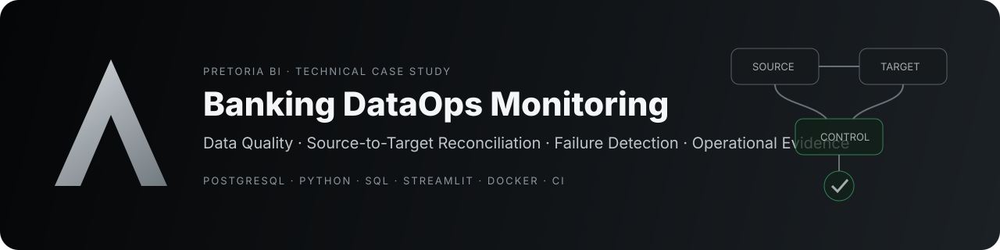
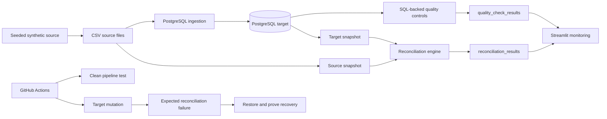

<div align="center">



# Banking DataOps Monitoring

### A synthetic transaction-control system for data quality, reconciliation and operational evidence

**PostgreSQL · Python · SQL · Data Quality · Source-to-Target Reconciliation · Streamlit · Docker · CI**

[PRETORIA BI](https://pretoriabi.com) · [PROOF MATRIX](docs/proof_matrix.md) · [ARCHITECTURE](docs/architecture.md) · [VALIDATION](docs/VALIDATION.md)

</div>

---

## The control question

> **Can an analytics team prove that every source transaction reached the target store without silent loss, duplication or amount mutation?**

This repository implements a compact DataOps control loop around that question.

It generates seeded synthetic transaction feeds, loads them into PostgreSQL, applies data-quality controls, performs an actual **source CSV → PostgreSQL reconciliation**, persists the evidence and exposes the operational state through Streamlit.

No real banking, client or production data is used.

---

## What the system proves

```text
SYNTHETIC SOURCE CSV
        │
        ├── row count
        ├── amount total
        ├── transaction IDs
        └── per-ID amounts
        │
        ▼
   PostgreSQL target
        │
        ▼
DATA QUALITY CONTROLS
        │
        ▼
SOURCE ↔ TARGET RECONCILIATION
        │
        ├── count delta
        ├── amount delta
        ├── missing IDs
        ├── unexpected IDs
        ├── duplicate IDs
        └── amount mismatches
        │
        ▼
 PASS / FAIL EVIDENCE
        │
        ├── persisted control results
        ├── monitoring dashboard
        └── CI reverse test
```

The important part is not that a reconciliation function exists.

The repository deliberately **mutates one target amount inside CI and requires the reconciliation command to fail**. The target is then restored and the same control must return to PASS.

That is the reverse test for the central claim.

---

## Proof map

| Claim | Evidence | Reverse test |
|---|---|---|
| Source-to-target reconciliation is real | `reconciliation.py` compares source CSV with PostgreSQL | CI alters one target amount and expects a non-zero exit |
| Data-quality controls are executable | SQL-backed controls + Python runner | control result logic is unit-tested |
| The pipeline is reproducible | generator + ingestion + Docker + Makefile | CI rebuilds the flow from seeded synthetic data |
| Failures are visible | persisted reconciliation status + Streamlit | corrupted target produces FAIL evidence |
| Software quality is enforced | `pytest` + `ruff` + compile step | every push and PR runs validation |
| Public data is safe to inspect | seeded synthetic generator | repository policy excludes real operational data |

Full mapping: [docs/proof_matrix.md](docs/proof_matrix.md).

---

## Architecture



Detailed design: [docs/architecture.md](docs/architecture.md).

---

## Reconciliation contract

A reconciliation passes only when all of the following are true:

- source and target row counts match;
- source and target amount totals match to the cent;
- no source transaction is missing from the target;
- no unexpected transaction exists in the target;
- no shared transaction ID has a different amount;
- no duplicate transaction ID exists in either snapshot.

The CLI fails closed:

```bash
python -m banking_dataops.reconciliation
```

A mismatch returns a non-zero process exit code, making the control usable in CI or scheduled orchestration.

---

## Data-quality controls

| Control | Risk detected |
|---|---|
| Critical nulls | incomplete operational records |
| Duplicate transaction IDs | duplicate processing |
| Invalid amounts | impossible or out-of-policy values |
| Referential integrity | orphan transactions |
| Risk-score range | malformed analytical features |
| Status validity | unexpected lifecycle state |
| Freshness | stale data |
| Source-to-target reconciliation | silent loss, insertion or mutation |

Control ownership and evidence are documented in [docs/controls_matrix.md](docs/controls_matrix.md).

---

## Quickstart

### Requirements

- Python 3.12+
- Docker / Docker Compose

### Run the clean pipeline

```bash
make install
make up
make generate
make ingest
make quality
make reconcile
make dashboard
```

Or rebuild the local synthetic environment:

```bash
make reset
```

---

## Reverse test locally

First prove the clean flow:

```bash
make reset
```

Then alter one target value:

```sql
UPDATE transactions
SET amount_chf = amount_chf + 1
WHERE transaction_id = (
    SELECT MIN(transaction_id)
    FROM transactions
);
```

Run:

```bash
make reconcile
```

Expected result: **FAIL** with an amount delta and transaction-level amount mismatch.

Restore with:

```bash
make ingest
make reconcile
```

Expected result: **PASS**.

---

## Repository structure

```text
banking-dataops-monitoring/
├── .github/workflows/ci.yml
├── assets/
├── dashboard/
├── data/
├── docs/
├── output/
├── sql/
├── src/banking_dataops/
├── tests/
├── docker-compose.yml
├── Makefile
├── pyproject.toml
└── README.md
```

---

## Engineering boundaries

This is a **public technical case study**, not a bank-grade production platform.

What is intentionally demonstrated:

- relational modelling;
- seeded synthetic source generation;
- ingestion;
- SQL-backed controls;
- Python orchestration;
- transaction-level source/target reconciliation;
- failure detection;
- monitoring;
- testing;
- CI;
- operational documentation.

Known technical limitation:

- reconciliation currently validates transaction identity and `amount_chf`, not byte-for-byte equality of every transaction attribute; a production extension could compare canonical row hashes or field-level contracts.

What is intentionally not claimed:

- production scale;
- regulatory certification;
- real fraud detection;
- real banking integration;
- production alerting or observability;
- production-grade secrets management.

Those boundaries are part of the evidence, not disclaimers added after the fact.

---

## Documentation

| Document | Purpose |
|---|---|
| [Technical case study](PORTFOLIO.md) | business/engineering summary |
| [Architecture](docs/architecture.md) | execution and control flow |
| [Proof matrix](docs/proof_matrix.md) | claims mapped to verifiable evidence |
| [Data dictionary](docs/data_dictionary.md) | table and field definitions |
| [Controls matrix](docs/controls_matrix.md) | controls mapped to operational risk |
| [Validation](docs/VALIDATION.md) | local and CI verification |
| [Incident runbook](docs/incident_runbook.md) | failure investigation workflow |
| [Monitoring plan](docs/monitoring_plan.md) | monitored states and future observability |
| [Rollback plan](docs/rollback_plan.md) | safe reset of the synthetic environment |

---

<div align="center">

### Built as public technical evidence for [Pretoria BI](https://pretoriabi.com)

**DATA · INTELLIGENCE · PERFORMANCE**

</div>
