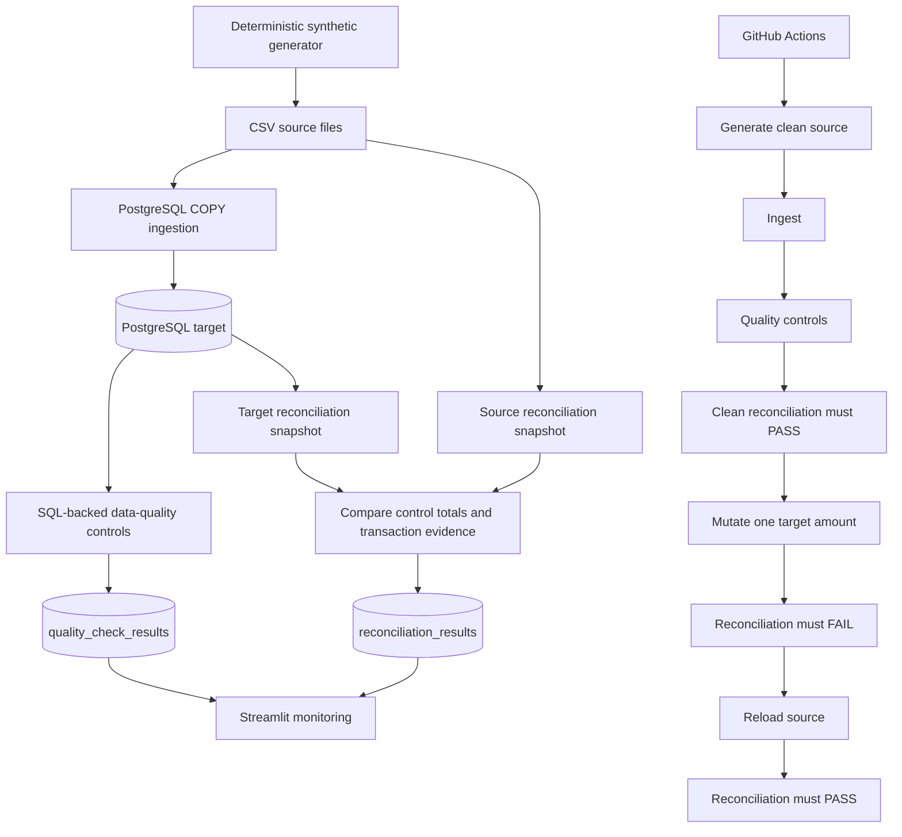

# Architecture — Banking DataOps Monitoring

## Control objective

The system answers one operational question:

> Can we prove that the synthetic transaction source and the PostgreSQL analytical target remain materially identical after ingestion?

The architecture therefore separates **source evidence**, **target evidence**, **quality controls** and **reconciliation controls** instead of treating database summaries as reconciliation.

## Execution flow



## Source boundary

The source of truth for reconciliation is:

```text
data/synthetic_transactions.csv
```

The source snapshot captures:

- row count;
- amount total to the cent;
- complete set of transaction IDs;
- duplicate transaction IDs;
- amount by transaction ID.

## Target boundary

The target state is read independently from PostgreSQL:

```sql
SELECT transaction_id, amount_chf
FROM transactions
ORDER BY transaction_id;
```

The same control evidence is calculated from the target rows.

## Reconciliation decision

A reconciliation is `PASS` only when:

1. target row count equals source row count;
2. target amount total equals source amount total;
3. no source transaction ID is missing from the target;
4. no unexpected target ID exists;
5. no shared transaction ID has a different amount;
6. neither snapshot contains duplicate transaction IDs.

Any failed condition produces `FAIL`.

The CLI exits non-zero on failure, which makes the reconciliation enforceable by CI or an orchestrator rather than merely descriptive.

## Quality-control layer

PostgreSQL-backed controls independently test:

- critical nulls;
- duplicate transactions;
- invalid amounts;
- orphan transactions;
- invalid risk scores;
- invalid statuses;
- freshness.

Quality checks and reconciliation serve different purposes:

- **quality controls** test whether target data satisfy defined rules;
- **reconciliation** tests whether target data faithfully represent the source.

## Monitoring layer

Streamlit reads persisted control evidence from:

- `quality_check_results`;
- `reconciliation_results`;
- transaction summary queries.

It does not calculate reconciliation itself.

## CI reverse test

The CI pipeline deliberately mutates one target transaction amount by CHF 1.00.

A successful workflow requires:

```text
clean source/target        -> PASS
silent target mutation     -> FAIL
source state restored      -> PASS
```

This prevents the repository from claiming reconciliation solely because the happy path returns zero deltas.

## Scope boundary

This architecture is intentionally local and synthetic.

It demonstrates control design, failure detection and reproducibility. It does not claim production scale, regulated deployment or real bank integration.
